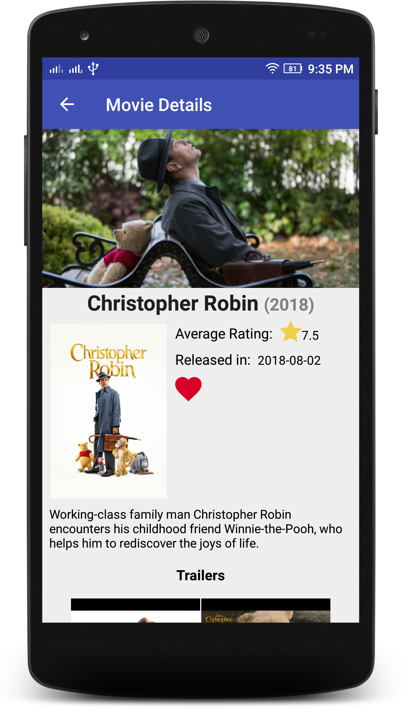
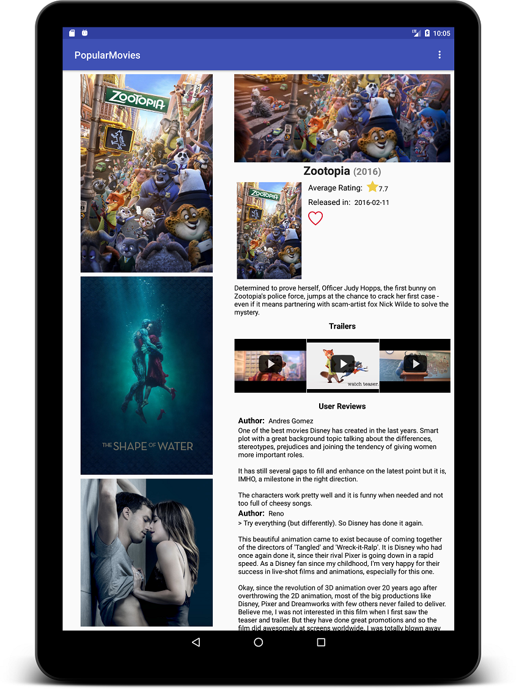

# Popular Movies

Discover movies sorted by most popular or highest rated and create your own library of favorite movies.

# Features:

- Find information about movies such as release date, rating, movie poster, vote average, and plot synopsis.
- Save your favorite movies and access to their information offline.
- Find user reviews and movie trailers.

# Before using this app:

- This app uses [The Movie Database](https://developers.themoviedb.org/3/getting-started/introduction) API. In order to use it, you must enter your API key.

# Screenshots

